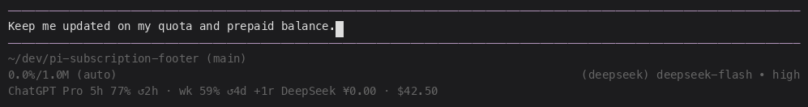

# pi-subscription-footer

ChatGPT subscription quota and DeepSeek prepaid balance in [pi](https://pi.dev)'s own footer.

The line is added with `ctx.ui.setStatus()`, so it appears **below** pi's built-in
token/cost line rather than replacing the footer. It is wrapped in the footer's
own `dim` colour, so it does not compete with the rest of the interface.



Example shown with fictitious account data in an isolated pi session.

```text
0.0%/1.0M (auto)                                   (deepseek) deepseek-flash • high
ChatGPT Pro 5h 77% ↺2h · wk 59% ↺4d +1r DeepSeek ¥0.00 · $42.50
```

## Install

```sh
pi install npm:pi-subscription-footer
```

Then `/reload`.

## What it shows

| Provider | Source | Shown as |
|---|---|---|
| ChatGPT (Codex) | `GET https://chatgpt.com/backend-api/wham/usage` | `ChatGPT <plan> 5h 77% ↺2h · wk 59% ↺4d +1r` |
| DeepSeek | `GET https://api.deepseek.com/user/balance` | `DeepSeek $42.50` (or `DeepSeek ¥0.00 · $42.50` for multiple currencies) |

- ChatGPT percentages show **quota remaining**, calculated as `100 − used_percent`
  from the API, clamped to 0–100% (e.g. 23% used appears as 77% remaining).
  DeepSeek shows the remaining prepaid balance (`total_balance`).
- Only the quota windows the plan actually returns are shown: a rolling window
  (labelled with its reported duration, e.g. `5h` or `90m`) and/or the weekly
  window (`wk`). Plans with only a weekly window show a single entry.
- `+1r` means a banked rate-limit reset is available.
- DeepSeek shows every valid currency balance returned by the API, with its
  corresponding symbol (USD uses `$`, not `¥`).
- **Nothing is shown on first load when neither provider returns displayable
  data.** An absent provider is not an error.

## Refresh

| Trigger | When |
|---|---|
| start of a session | immediately on start and on `/reload` |
| start of a run | at `agent_start`, at most once a minute |
| model switch | at `model_select`, at most once a minute |
| timer | every 5 minutes |

Once shown, the footer line stays in place to avoid shifting the transcript.
Failed lookups or rejected credentials remove their stale values; if no provider
can be verified, the line reads `Subscription data unavailable`. Lookups are
never made outside the interactive TUI: `print`, `rpc` and `json` modes do not
hit the network.

## Credentials

Nothing is configured by hand; the extension reuses what pi already has.

- **ChatGPT** — the `openai-codex` OAuth entry in `~/.pi/agent/auth.json`,
  written by `/login openai-codex`. Nothing is sent anywhere except
  `chatgpt.com`, with the same bearer token pi uses.
- **DeepSeek** — `PI_DEEPSEEK_API_KEY`, then `DEEPSEEK_API_KEY`, then the
  `deepseek` entry in `~/.pi/agent/auth.json`. The key is only sent to
  `api.deepseek.com`.

The extension reads nothing else and writes nothing to disk.

## Notes

- The extra line makes the footer one row taller. In pi's default `regular` TUI
  mode the footer is not anchored to the bottom of the screen, so after a run
  the reprinted footer can leave blank rows below it. This happens with or
  without this extension; `tuiMode: "fullscreen"` avoids it entirely.
- A rejected or expired credential hides that provider's values. Re-run
  `/login openai-codex` to restore the ChatGPT entry.

## Development

Requires Node 24 or newer; the tests run TypeScript directly through Node's
type stripping.

```sh
npm test
```

The suite covers the pure parsing and formatting helpers in
`extensions/subscription-status.ts` plus the event wiring: which providers are
rendered, that a free plan is hidden, that stale values are replaced without
clearing the status line, that the network is untouched outside the TUI,
and that event-driven refreshes are throttled.

## Publishing

Publishing to npm is manual and separate from GitHub releases; from a clean
checkout:

```sh
npm login
npm test
npm publish --access public
```

Update the version, commit, tag `v<version>`, and create a GitHub release.
GitHub-generated notes put PRs labelled `changelog` under **What's Changed**;
all other PRs go under **Other Changes** (see `.github/release.yml`). CI runs
the tests on every push and pull request; it does not publish.

## License

MIT
